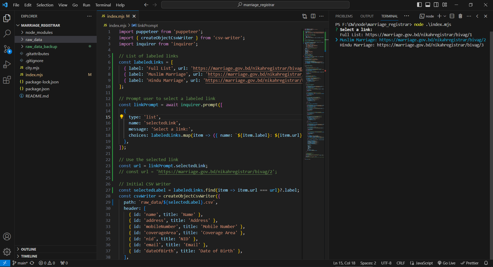

# Marriage Registrar Data Scraper



## Introduction

This repository contains scripts to scrape marriage registrar data from the [Bangladesh Marriage Registrar](https://marriage.gov.bd/) website. The data is collected using Puppeteer, a Node library which provides a high-level API to control headless browsers.

## Prerequisites

Before running the scripts, ensure that you have Node.js and npm installed on your machine.

```bash
# Install dependencies
npm install

node index.mjs

node city.mjs